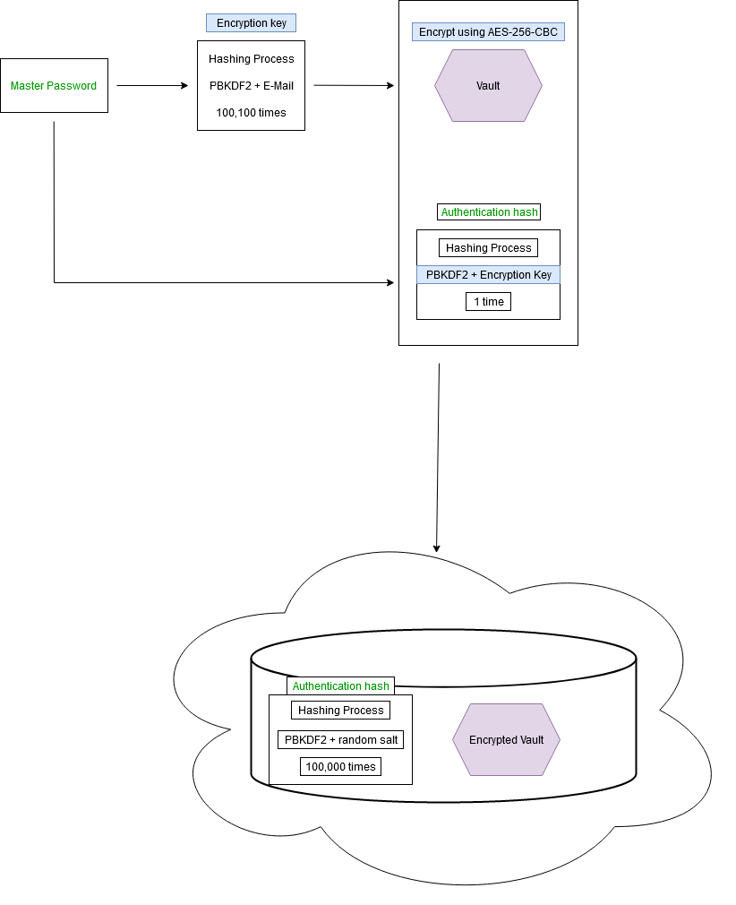

**vaults** is a password manager featuring client side AES-256 encryption, PBKDF2 hashing, vaults, password generation & more.

---

1. [Technical overview](#technical-overview)
    1. [Vaults](#vaults)
    2. [Entities](#entities)
    3. [Categories](#categories)
    4. [Front end](#front-end)
        1. [Front end technologies](#front-end-technologies)
    5. [Back end](#back-end)
        1. [Back end technologies](#back-end-technologies)
    6. [Other technical details](#other-technical-details)
    7. [Security schema](#security-schema)
2. [Contributing & Getting started](#contributing--getting-started)
3. [License](#license)

## Technical overview

This application consists of multiple parts:

* front end
* back end(API)
* storage

### Vaults

A "vault" is a collection of multiple items(or entities, more on them below). It is the highest unit to save items in & must have a name & description.
Users can use it to differentiate between personal items, work related items, family, games etc.

### Categories

A "category" is used to group items inside a vault. It must have a name and there can be any amount of them in each vault.

### Entities

#### Login

The "login" represents an online account. It contains the following fields:

- name(the name of the login)
    - required
- username
    - required
- email
- website
    - required
- password
- description

#### Note

A "note" can be freely used for whatever else and serves as a blueprint for other items the user might have a need for,
such as Wi-Fi passwords, membership cards, SSH keys, and much more. These are the fields of the note:

- name(the name of the note)
    - required
- description

### Front end

The front end has a wide range of responsibilities such as:
- entity modeling,
- creation of the user encryption key based on the master password & using the email as a salt,
    - 100100 iterations of PBKDF2
- creation of the authentication hash based on the master password & using the encryption key as a salt,
    - 1 extra iteration of PBKDF2
- encrypting the data before sending it off to the backend,
    - AES-256 in CBC mode
- decrypting the data after a successful request using the encryption key
- managing the data reactively and globally using state management
- being a single page application/UI
- offering a mobile first design experience

#### Front end technologies

- Vue.js 3
- Vuex
- [VeeValidate](https://vee-validate.logaretm.com/v4/) for dynamic and easier form handling & validation
- Asynchronous HTTP requests with Axios
- [aes-js](https://github.com/ricmoo/aes-js)
- [pbkdf2](https://github.com/crypto-browserify/pbkdf2)
- SCSS

### Back end

The back end has the following responsibilities:

- user authentication
  - additional 100000 iterations of PBKDF2 on the authentication hash
- handling CRUD operations on the entities in a RESTful manner
  - complete secrecy regarding the entities; the back end entities comprise only of a field called "data" and respective keys.
   the data field is fully encrypted from the front end.
- offering storage
- acting as an API on a subdomain and actively handling CORS and CSRF
- UUID strategy for the primary keys of all the entities

#### Back end technologies

- Symfony 5.3.6
- PHP 8.0
- MySQL 8.0

### Other technical details

This project runs completely on Docker, be it the back end, front end, server hosting(NGINX) & database. Docker Compose is used for orchestration.

### Security schema

Explanation of the security model:

The user registers using a master password, which is firstly hashed into an encryption key using the unique email address as a salt. The master password is then used
to create an authentication hash using the encryption key as a salt; the authentication hash is the value that gets sent to the back end for it to be hashed again using a randomly generated salt, and which will eventually
be the value the user authenticates against.

The vault and every other data inside gets encrypted with the mentioned encryption key before doing any operation and sending to the backend. On successful requests the vault will then be decrypted by the front end.

## Contributing & Getting started

Do you want to get involved? Please refer to [the contributors documentation](docs/CONTRIBUTORS.md)

## License

[GPLv3](LICENSE)
